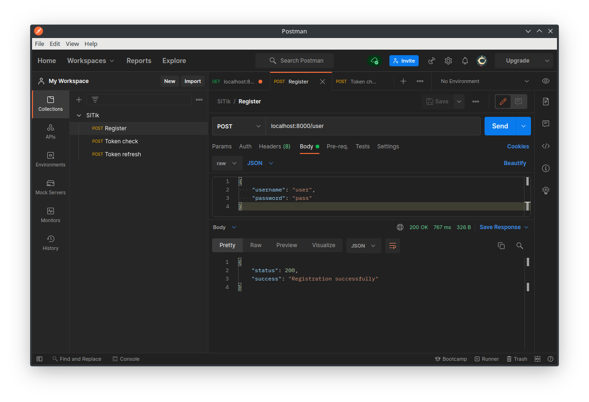
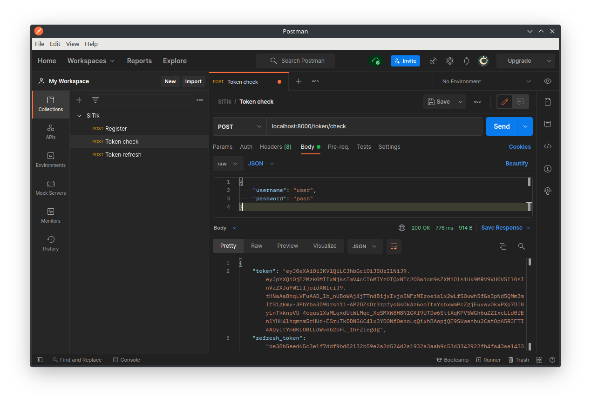
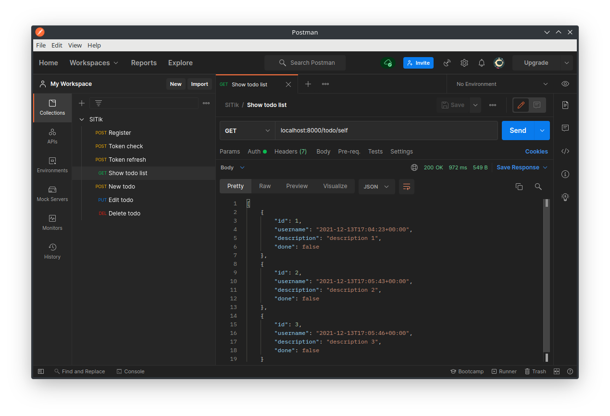
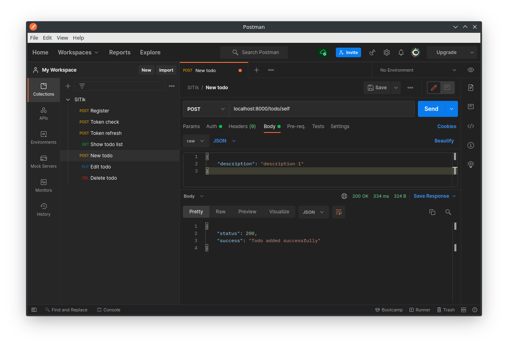
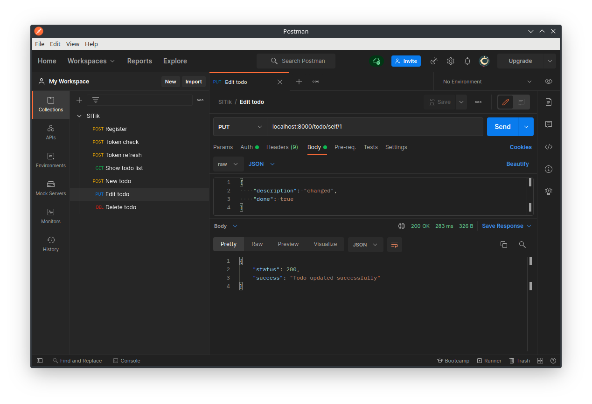
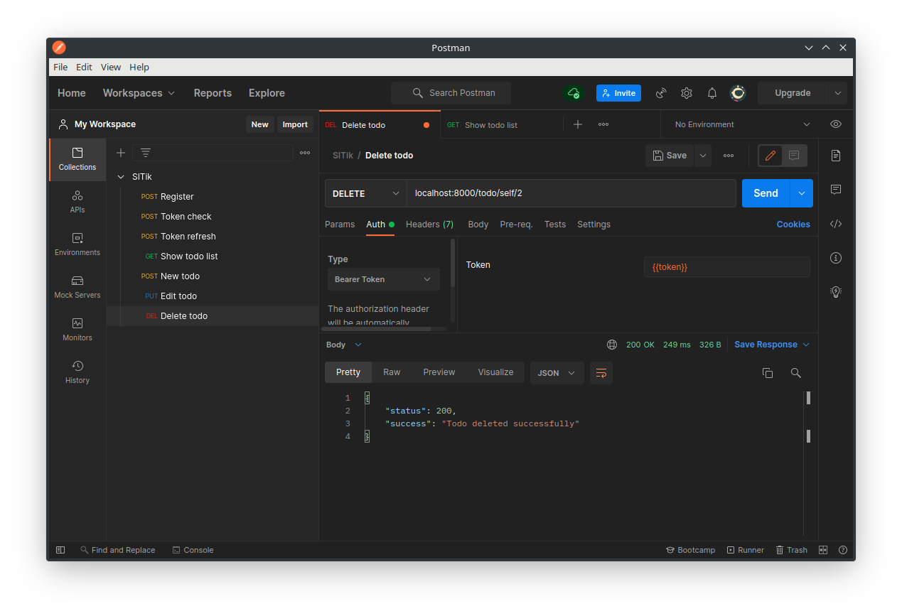
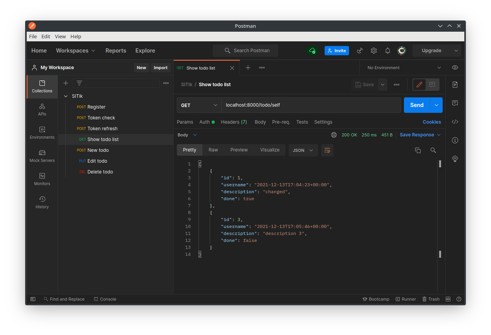

### Лабораторная работа №1.
Запуск сервера:
```
symfony server:start
```
Ручки:
+ Регистрация

+ Авторизация

+ Получить свой список задач

+ Добавить себе задачу

+ Обновить свою задачу

+ Удалить свою задачу

+ Получить свой список задач после изменения и удаления
